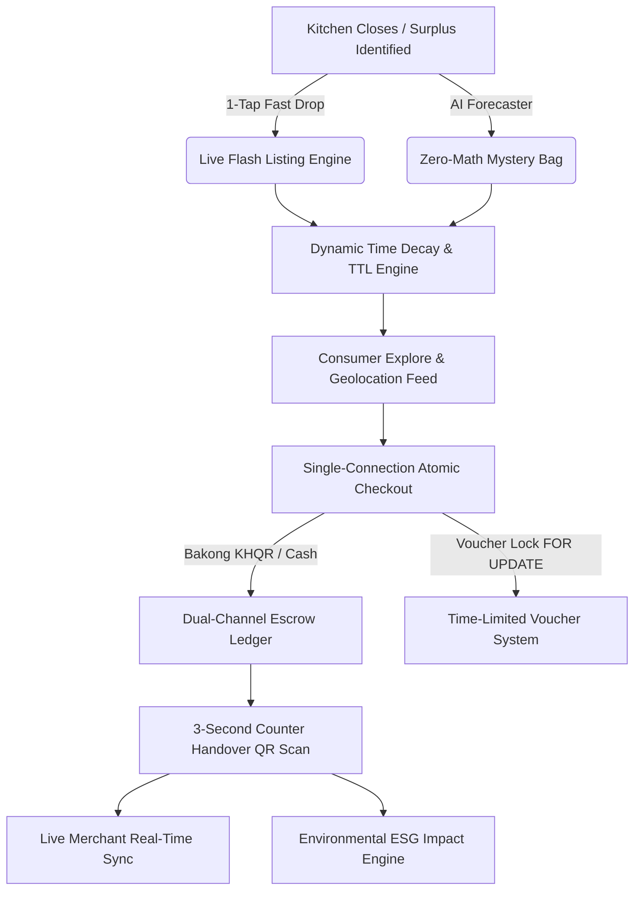
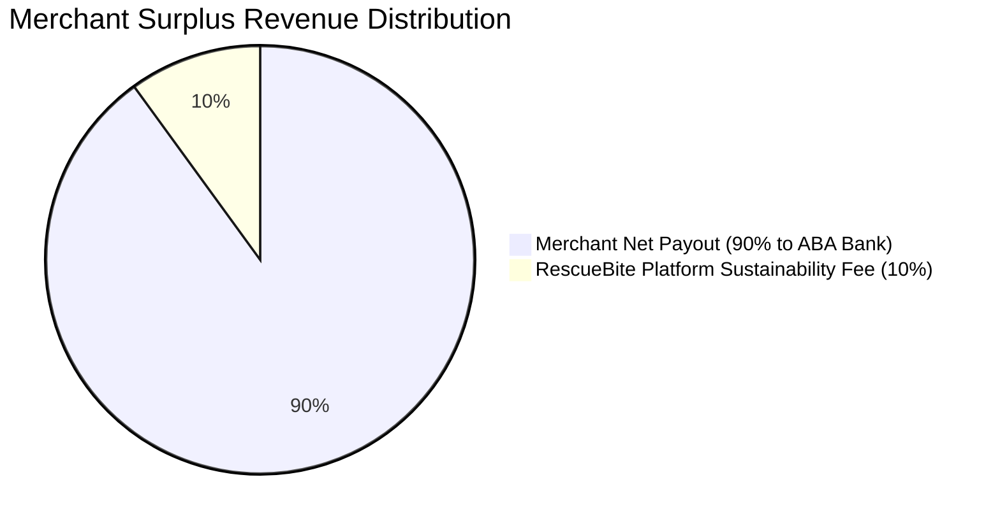

# 💎 RescueBite (ReBite) — Technical Architecture & Specialized Features Guide
> **Comprehensive breakdown of proprietary logic, anti-waste algorithms, financial mechanics, and concurrency architectures that set RescueBite apart from standard e-commerce and delivery platforms.**

---

## 🌟 Executive Summary: Why RescueBite is Not a Standard E-Commerce Website

Traditional e-commerce platforms (Shopify, WooCommerce) and standard food delivery apps (Grab, Foodpanda) are built for static catalogs, scheduled couriers, and standard credit-card checkouts. 

**RescueBite is purpose-built for high-speed, unpredictable food surplus recovery.** Food surplus is highly perishable, volatile, and time-decaying. RescueBite solves this with real-time dynamic pricing, server-authoritative expiration workers, atomic concurrency locking, multi-tier mystery bag generation, and localized dual-currency financial escrow tailored for Cambodia.



---

## 📑 Core Specialized Logic & Differentiators

---

### 1. ⚡ Flash Surplus Expiration Engine & Dynamic Time Decay
*Standard websites treat product listings as static until deleted or set out-of-stock. RescueBite treats every surplus drop as a time-decaying perishable asset.*

1. **Server-Authoritative Time-To-Live (TTL):**
   - Every live single-item drop and mystery surprise bag has a strict `pickup_start`, `pickup_end`, and computed `expires_at` timestamp based on DB server time (`CURRENT_TIMESTAMP`).
   - Prevents client clock tampering from extending expired listings.
2. **Automated Expiry Worker (`expiryWorker.ts`):**
   - Background sweeping engine that transitions past-deadline items from `LIVE` $\rightarrow$ `EXPIRED`.
   - Expired listings are instantly pruned from consumer feeds to ensure customers never arrive at a closed merchant.
3. **Dynamic Urgency Badging:**
   - Listings dynamically calculate remaining pickup time: displays `"1h 30m left"`, switches to high-visibility amber pulse when `< 30m`, and flags `"Expiring soon"` under 15 minutes.
4. **Instant Kitchen Restock / Sold-Out Overrides:**
   - If walk-in counter customers purchase surplus food directly, merchants can tap **"Sold Out"** to vanish the drop immediately from the app, or tap `+ / -` to adjust available trays without recreating listings.

---

### 2. 🛡️ Single-Connection Atomic Checkout & Concurrency Protection
*Standard platforms often use separate read-then-write checks which suffer from race conditions during flash sales. RescueBite guarantees zero overselling through DB-level transaction locks.*

1. **Single-Connection Transaction Isolation (`BEGIN ... COMMIT / ROLLBACK`):**
   - In `order.routes.ts`, order creation acquires a dedicated PostgreSQL connection client from the pool (`pool.connect()`) ensuring all validations and mutations happen within a single atomic block.
2. **Row-Count-Validated Inventory Decrement:**
   ```sql
   UPDATE inventory_items 
   SET quantity = quantity - $1 
   WHERE id = $2 AND quantity >= $1;
   ```
   - If two customers press checkout at the exact same millisecond for the last remaining item, exactly one receives `rowCount = 1` and proceeds; the second fails the `quantity >= $1` condition, triggers an automatic transaction `ROLLBACK`, and returns a clean `409 Conflict`.
3. **Cross-Merchant Cart Validation:**
   - Strict DB verification ensures add-ons and surplus bags belong exclusively to the target merchant before deducting inventory or charging funds.

---

### 3. 🎟️ Time-Limited Voucher Engine & DB-Level Idempotency
*Standard coupon systems use static codes with unlimited or coarse date checks. RescueBite implements high-security, time-limited reward vouchers with points economy safeguards.*

1. **Server-Side Expiration Lifecycle (`ACTIVE` $\rightarrow$ `USED` $\rightarrow$ `EXPIRED`):**
   - Customer points redemptions generate unique `customer_vouchers` records with individual 7-day deadlines (`expires_at = CURRENT_TIMESTAMP + INTERVAL '7 days'`).
   - Both lazy validation (on retrieval/checkout) and periodic sweeps ensure past-deadline vouchers cannot be applied.
2. **Database Idempotency Protection (`idx_customer_vouchers_idempotency`):**
   ```sql
   CREATE UNIQUE INDEX idx_customer_vouchers_idempotency 
   ON customer_vouchers (customer_id, idempotency_key) 
   WHERE idempotency_key IS NOT NULL;
   ```
   - Prevents duplicate voucher issuance or double points deduction caused by rapid double-tapping or network retries.
3. **Transactional Voucher Locking (`SELECT ... FOR UPDATE`):**
   - During checkout, the voucher row is locked inside the transaction. If order creation fails or aborts mid-checkout, the voucher automatically rolls back to `ACTIVE`.
   - If an order succeeds, the voucher is atomically updated to `USED` and linked to the order ID.

---

### 4. 💰 Dual-Channel Financial Reconciliation & Escrow Ledger
*Standard websites support only single-gateway payments. RescueBite integrates Cambodia's national Bakong KHQR with an escrow ledger that reconciles both digital and physical cash transactions.*



1. **Bakong Dynamic KHQR Generation:**
   - Generates instantaneous, compliant EMVCo KHQR codes in both USD ($) and Khmer Riel (KHR ៛) at official conversion rates (4,100 KHR/USD).
2. **Hybrid Settlement Matrix:**
   - **Digital KHQR / Card Orders:** Customer pays 100% upfront into digital escrow. 90% is settled to the merchant's ABA Bank account; 10% platform commission is retained.
   - **Cash-at-Counter Orders:** Customer pays merchant 100% in cash at pickup. The platform's 10% fee is debited from the merchant's digital escrow reserve pool, ensuring zero manual invoicing friction.
3. **Executive Financial Recovery Ledger (`MerchantDashboardView.tsx`):**
   - Tracks Gross Surplus Saved, Digital Escrow Balance, Cash Platform Fees, and Weekly Net Payout dates.

---

### 5. 🤖 AI Surplus Forecaster & Zero-Math Mystery Bags
*Standard websites force merchants to manually compose and price products. RescueBite uses predictive analytics and automated tier templates so merchants can publish surplus in under 3 taps.*

1. **AI Predictive Forecasting Algorithm:**
   - Evaluates day-of-week demand curves (e.g. higher Sunday evening bakery surplus), weather conditions (rainy days reduce walk-in traffic by 35%), and store category trends.
   - Calculates estimated unsold items and generates recommended mystery bag quantities.
2. **"⚡ 1-Click Auto-Drop AI Bag":**
   - Store managers can publish the AI-generated recommendation straight to the live feed in 1 tap without typing a single character.
3. **Zero-Math Dynamic Pricing Tiers:**
   - **Light Saver Bundle:** \$2.50 (Retail value: \$6.00+ • 58% OFF)
   - **Signature Bakery Box:** \$3.80 (Retail value: \$10.00+ • 62% OFF)
   - **Mega Family Rescue Pack:** \$6.50 (Retail value: \$18.00+ • 64% OFF)
   - Automatically generates bilingual English & Khmer descriptions, allergen disclaimers, and minimum 50% discount verification ($\ge 40\%$ platform rule).
4. **Bakery Pricing Assistant & Margin Calculator:**
   - Merchants enter standard retail tray quantities and wholesale costs; assistant computes optimal rescue price, salvage revenue, and profit margin yield.

---

### 6. 📱 3-Second Counter Handover & QR Verification Workflow
*Standard retail platforms rely on printed receipts or cumbersome delivery tracking. RescueBite optimizes for rapid walk-in customer turnover.*

1. **Dual Verification Pipeline:**
   - **Mode A (Camera QR Scanner):** Merchant scans customer's animated dynamic pickup QR code.
   - **Mode B (4-Digit Backup Code):** Walk-in counter staff enters 4-digit code (e.g. `RB-5828`) if the customer's phone screen is cracked or low battery.
2. **Optimistic React UI Synchronization:**
   - Counter verification triggers instantaneous UI state transition to `COMPLETED` on both customer and merchant screens without requiring page reloads.
3. **Customer No-Show & Abuse Prevention:**
   - Counter staff can trigger **"Report No-Show"** if orders are abandoned at closing time.
   - Voids the reservation, automatically logs a strike against the customer's account, and allows instant restocking.

---

### 7. 🔍 Multi-Dimensional Trust & 2-Hour Food Safety Compliance
*Standard review systems are generic 1–5 star ratings. RescueBite enforces food safety tracking and granular quality metrics.*

1. **2-Hour Safe Consumption Window:**
   - Every verified handover displays a food safety timer reminding consumers to consume or properly refrigerate freshly rescued bakery/prepared food within 2 hours.
2. **3-Pillar Multidimensional Ratings:**
   - Customers evaluate orders on three targeted criteria:
     1. **Food Quality & Freshness** (1–5★)
     2. **Value for Money** (1–5★)
     3. **Pickup & Counter Experience** (1–5★)
3. **Interactive Review Inspection & Public Store Reply:**
   - Merchants inspect detailed customer commentary, verified handover timestamps, and can publish public store replies directly from the queue.
4. **Order Queue State Machine Filters:**
   - Instant filtering between **All Orders**, **Ready for Pickup**, **Completed**, **Cancelled / Voided**, and **No Review Yet**.

---

### 8. 🌍 Real-Time Environmental & ESG Carbon Ledger
*Standard e-commerce provides only financial summaries. RescueBite turns surplus rescue into audited sustainability metrics.*

1. **Scientific Carbon Equivalent Models:**
   $$\text{Food Waste Diverted} = \text{Meals Rescued} \times 0.75\text{ kg}$$
   $$\text{Greenhouse Gas Avoided } (\text{CO}_2\text{e}) = \text{Meals Rescued} \times 1.80\text{ kg}$$
   $$\text{Equivalent Car Distance Offset} = \text{Meals Rescued} \times 7.20\text{ km}$$
2. **Personal & Store ESG Dashboards:**
   - Live counters calculate cumulative lifetime metrics for both individual consumers and merchant chains.
   - Includes social impact sharing cards for Instagram/Telegram highlighting store waste reduction milestones.

---

## 📊 Comparison Matrix: RescueBite vs. Standard Platforms

| Feature / Architecture | Standard E-Commerce (Shopify / WooCommerce) | Standard Food Delivery (Grab / Foodpanda) | **RescueBite (ReBite)** |
|---|---|---|---|
| **Inventory Model** | Static stock count | Menu-based regular stock | **Perishable time-decaying surplus drops** |
| **Pricing Model** | Fixed full retail price | Full price + delivery markups | **Guaranteed 40%–70% rescue discount** |
| **Expiration Handling** | None (manual removal) | Store open/closed toggle | **Automated TTL engine with background expiry worker** |
| **Checkout Concurrency** | Basic optimistic locks | Standard order queue | **Single-connection DB transaction + row-count decrement** |
| **Voucher Engine** | Static string promo codes | Account promo vouchers | **Time-limited points vouchers + DB idempotency locks** |
| **Payment & Escrow** | Cards / Gateway checkout | Digital wallet / COD | **Dynamic Bakong KHQR dual-channel escrow (USD + KHR)** |
| **Merchant Workflow** | Long fulfillment cycles | Courier dispatch tracking | **3-second counter QR handover with no-show strike protection** |
| **Listing Creation** | Manual multi-field form | Manual menu updates | **AI surplus forecast & 1-tap zero-math mystery bags** |
| **Safety Compliance** | None | Delivery bag tracking | **2-hour fresh consumption window timer** |
| **ESG Impact Ledger** | None | Optional carbon offset fee | **Automated kg food saved, CO₂e avoided & car km offset** |

---

## 🏛️ Technical Stack Summary

- **Frontend:** React 19, TypeScript, TailwindCSS, Lucide Icons, Vite, HTML5 Canvas Image Compression.
- **Backend & APIs:** Node.js, Express, TypeScript, PostgreSQL (`pg` pool), `pg_trgm` spatial fuzzy search, automated cron sweeps.
- **Financial Gateway:** National Bank of Cambodia Bakong KHQR (EMVCo compliant), ABA Pay integration.
- **Testing & Verification:** Comprehensive automated integration suites (`test_concurrency.ts`, `test_live_drop_workflow.ts`, `test_voucher_lifecycles.ts`).

---
*Documentation maintained by RescueBite Core Engineering Team.*
